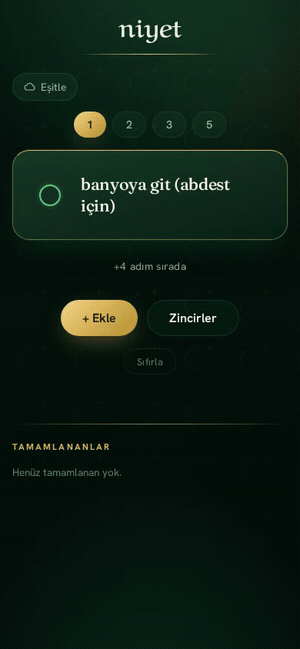
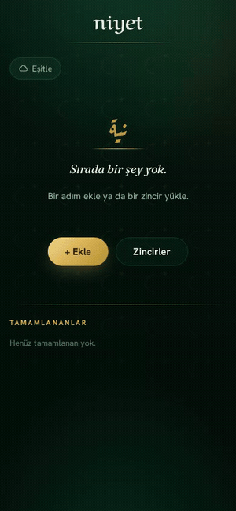
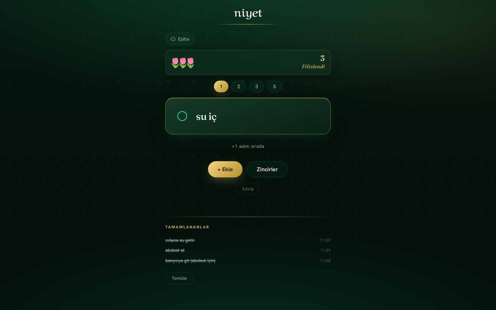
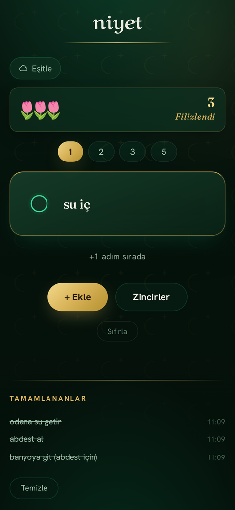
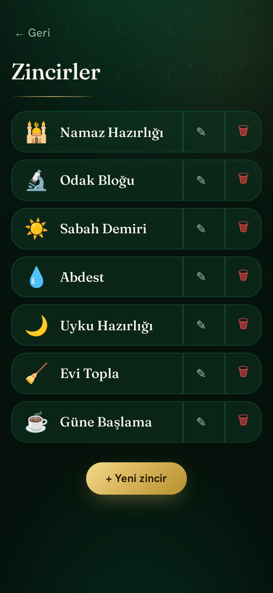

<div align="center">


# niyet app

**The moment between paralysis and the first step.**

*A task queue for the brain that gets stuck on the part where you start.*

[](LICENSE)
&nbsp;·&nbsp; React 19 &nbsp;·&nbsp; Vite &nbsp;·&nbsp; Supabase &nbsp;·&nbsp; Cloudflare &nbsp;·&nbsp; PWA

### 🌷 [**Try it live → niyet.burakgizlice.com**](https://niyet.burakgizlice.com)

*No sign-up, no setup. Open it and you're already in — add a step in seconds.*

</div>

---

> Hey — thanks for being here. 👋
>
> This one is personal. niyet didn't start as a side project or a portfolio piece; it started on a hard day, as something I genuinely needed and couldn't find. If you have a brain that gets stuck on the part where you *start*, I hope it helps you the way it helped me.
>
> You don't need to install anything or make an account to feel it — just open **[niyet.burakgizlice.com](https://niyet.burakgizlice.com)** and start. Everything saves on your device; signing in later is optional, and only ever *adds* (it never costs you what you already did). And if you just want to read how it came to be, the story is all here — pull up a chair.

## What this is

niyet is a small productivity app built for one specific moment: when you know what you need to do, and you cannot make your body begin.

It does not look like other to-do apps, because it was not built from best practices. It was built from a worst day. Most productivity tools are designed for a motivated person sitting at a clean desk. niyet is designed for the person lying on the floor who needs help standing up.

The core idea is simple and it runs against the grain of almost every task manager you've used:

> **You never see the whole list. You only see the next thing your body does.**

One action fills the screen. You do it. The next slides in. Behind that single card sits a queue you don't have to look at, a library of pre-saved rituals you can drop in with one tap, and a garden that grows a tulip every time you act — and *never* wilts when you don't.

> **niyet** — from the Arabic *niyyah* (نية): **intention.** The formal intention set before prayer, and the everyday decision to begin something. It is the exact gap the app lives in.

---

## A look inside

<div align="center">

<table>
<tr>
<td align="center" width="50%">
<br/>
<sub><b>One step at a time.</b><br/>Tap to finish — a qalam blade draws clean through it, and the <i>bostan</i> grows a tulip. It never wilts.</sub>
</td>
<td align="center" width="50%">
<br/>
<sub><b>A ritual in one tap.</b><br/>Seven decisions become one — load a chain and the queue fills itself.</sub>
</td>
</tr>
</table>

<br/>



<br/><br/>


&nbsp;&nbsp;&nbsp;


<br/>
<sub>On the phone it was made for — the single step, and the library of seven seeded rituals.</sub>

</div>

---

## The story behind it

This wasn't designed in a boardroom. It came out of a single honest conversation.

### The wall

It started with a confession, not a product idea. Severe ADHD, getting worse. Too many responsibilities. Paralysed. To pray — just to pray — the simplest act had to be broken into almost absurdly small pieces, typed one at a time into a terminal task manager:

> go to the bathroom for wudhu · bring water · drink water · stand before the prayer mat · open the egg timer · start a 15 minute timer · open project notes and read

The deeper problem was never the tasks. It was the **wall**. A single homogeneous to-do list — every item the same weight, stretching out endlessly — was the thing that caused the paralysis. Seeing the whole list triggered avoidance, not action. The list itself had become the enemy.

> *"It's not laziness. It's a brain that gets stuck on the part where you start."*

### Rebuilding the cockpit

The turning point was a reframe:

- **Three is the number.** Not five, not ten. The moment a list exceeds what you can hold in a single glance, it stops being a guide and becomes a wall. The fix isn't fewer tasks *total* — it's fewer tasks *visible*. **A queue, not a list.**
- **In a deep low, the system has to get dumber, not smarter.** When you're at the bottom, even three items is too many. The only valid question becomes: *what is the single next thing my body does?* Not your mind — your body. "Stand up." That's it.
- **Chain, don't list.** The seven steps of preparing to pray aren't seven tasks. They're one ritual. The brain fights seven decisions; it can accept one.
- **The tool itself is a procrastination trap.** You can spend an hour configuring a fancy task manager instead of making wudhu. The friction has to be near zero.

> *"You're not losing because you're weak. You're trying to use a neurotypical cockpit for a non-neurotypical brain. Rebuild the cockpit."*

The whole app is built around the worst day, not the best one.

### Was this already a thing?

A fair question. Pieces of it exist elsewhere — **One & Three** (one main + three small tasks/day), **Llama Life** (single-focus, gentle), **Forget** (your one task in a banner), **Goblin Tools** (AI splits tasks into micro-steps). But the specific combination — **pre-saved ritual chains + a single-visible-step queue + a reward loop that can't punish you** — didn't exist anywhere. The gap was real, and it was personal.

> *"The principles were scattered across other apps. The combination came from his own life."*

---

## The soul

This is where it stopped being a utility.

### Calligraphy and the tulip

- The Arabic word **نية** rendered in classic Amiri/naskh calligraphy on a deep emerald squircle.
- The Latin **"niyet"** drawn in **Aref Ruqaa** — an Arabic naskh calligraphic typeface whose Latin letters carry the reed-pen thick-thin modulation, so the name reads instantly but in the hand of Islamic calligraphy.
- The icon: a **pink Ottoman tulip** (*lale*). Not a random flower. The tulip is *the* sacred bloom of Turkish-Islamic art — its Arabic letters share a root with "Allah," which is why it filled the tiles of mosques. For an app called *intention*, growing a tulip is about as on-brand as a symbol gets.

> *"The icon isn't decoration. It's the same flower the garden grows."*

The brand system: **tulip + calligraphic "n"** as the app icon (legible at 48px on a crowded home screen), **tulip + full "niyet"** for the splash, and the **calligraphic wordmark** in the header. Typography pairs **Fraunces** (display), **Hanken Grotesk** (UI), and **Aref Ruqaa** (the Arabic accent), over a deep-emerald night with cream lettering and fine gold *girih* lines.

### A garden that never wilts

Forest is sticky because of **accumulation** — you look back and see something you built, proof you existed and acted. niyet borrows that: every completed task plants a tulip; the *bostan* (garden) fills and densifies as you go.

But here is the single most important decision in the project, and it is the **opposite** of how Forest works:

> **The garden never wilts. Empty days carry no penalty.**

Forest kills your tree when you leave. For someone fighting executive dysfunction, a guilt mechanic is poison — it turns the app into one more place you're failing on a bad day. In niyet, a barren day is just quiet soil, not a dead tree. The garden only ever grows.

> *"Most productivity apps are built on guilt. This one had to be built on mercy."*

### The reward — a calligraphic cut

The first reward (emoji confetti) felt too playful for how refined the app had become. The search for an alternative led back to that very first message — *losing wars against the nafs* — which is rooted in *jihad al-nafs*, the "greater jihad," the struggle against one's own lower self.

So completing a task became a **calligraphic blade-stroke**: a qalam-blade draws clean through the finished task and *stays*, the strike becoming the completion mark itself. A swift gold sweep, a spark at the tip, then it slides out with the card.

But it holds a deliberate restraint:

> *"The metaphor is self-mastery, not violence — gold light, not blood. And on your hardest days, when the wars feel lost, a martial theme can tip from empowering to one more arena where you're failing. The tool should meet you where you are."*

That tension — the motivating stroke and the merciful garden — is the emotional core of the whole app. It holds both the fight and the forgiveness.

### A sound designed around dopamine

The completion sound is the **"Clean Cut"**: two beats mirroring the stroke — a swift blade *swoosh* (band-passed noise sweep), a low body *thump* for weight, then a bright *gleam* and airy *sparkle* exactly where the spark lands. It's **fully synthesised live in the Web Audio API — no audio files** — so it fires instantly even on the slowest, worst moment, and works fully offline.

### The technical conscience

Every fancy addition was weighed against the app's reason for existing. When 3D (three.js) came up, the answer was no — not because it couldn't look cool, but because the entire promise is *zero friction when you're paralysed*. Heavier bundles, slower load, battery drain all work against someone one beat away from closing the app. The garden is built in flat, weightless 2D.

> *"The app's job is to lower friction. Any feature that raises it — no matter how impressive — is working against the user."*

---

## What it actually does

| | |
|---|---|
| 🎯 **Single-step queue** | One task fills the screen. Complete it, the next slides in. You never see the wall. |
| 👁️ **Show 1 / 2 / 3** | A toggle for better moments — reveal up to three at once. Defaults to one. |
| 🔗 **Chains** | Pre-saved rituals that load with one tap, turning seven decisions into one. Fully editable, with emoji + reorder. |
| 🌷 **The bostan (garden)** | Each completion plants a gold-line tulip. Milestones at 3 / 5 / 7 / 10+ (*Filizlendi → Bostan büyüyor → Laleler açtı → Koca bir bostan!*). Never wilts. |
| ⚔️ **Calligraphic cut** | The completion reward — a qalam blade-stroke + synthesised Clean Cut sound. |
| 📜 **Done log + Temizle** | A quiet, struck-through record of what you finished; one gesture clears it. |
| 📲 **Installable PWA** | Standalone, offline-capable, portrait, full app icon set + splash. |
| ☁️ **Anonymous-first sync** | Works with zero sign-up. Sign in later (magic link or Google) and your local queue, chains, done log, and settings **merge** into the cloud — nothing is lost. |
| ♿ **Reduced-motion aware** | Honors `prefers-reduced-motion` — the cut shows fully drawn, no animation. |
| 🇹🇷 **Turkish-first UI** | Built in the language it was needed in. |

### The seven default chains

Seeded ready-to-use, each a real ritual broken into body-sized steps:

🕌 **Namaz Hazırlığı** (prayer prep) · 💧 **Abdest** (wudhu) · 🔬 **Odak Bloğu** (focus block) · ☀️ **Sabah Demiri** (morning anchor) · 🌙 **Uyku Hazırlığı** (sleep prep) · 🧹 **Evi Topla** (tidy up) · ☕ **Güne Başlama** (start the day)

---

## Tech

A deliberately lean stack — chosen so the app loads fast and stays out of the way.

- **React 19** + **Vite 8** — small, fast, no router (a single in-memory view switch).
- **vite-plugin-pwa** — service worker, offline caching, installability.
- **Supabase** — Postgres + Auth (magic link & Google OAuth) + Row-Level Security. Four owner-scoped tables: `profiles`, `queue_items`, `chains`, `done_items`, each with RLS keyed to `auth.uid()`.
- **Cloudflare** (Workers/Pages via Wrangler) — hosting and deploy.
- **Web Audio API** — runtime-synthesised completion sound, zero asset files.
- **Vitest** + **ESLint** — tests and linting.
- **No CSS framework, no 3D, no heavyweight animation lib** — flat 2D, design tokens in a single `tokens.js`.

**Anonymous-first by design:** the app is fully usable with no account (state in `localStorage`). Authentication is purely additive — on first sign-in, `mergeOnLogin` reconciles local and remote state (chains use `updated_at` as a tiebreaker) so signing in never costs you data.

---

## Getting started

Just want to *use* it? It's live at **[niyet.burakgizlice.com](https://niyet.burakgizlice.com)** — no account, nothing to install. Everything below is for running it yourself.

Clone it, install, run — that's the whole ceremony.

```bash
npm install
npm run dev          # local dev server (Vite)
```

To enable cloud sync, copy the environment template and add your Supabase keys:

```bash
cp .env.example .env
# set VITE_SUPABASE_URL and VITE_SUPABASE_ANON_KEY
```

The database schema lives in [`supabase/migrations/`](supabase/migrations/) — run it in the Supabase SQL editor or via the CLI/MCP. Without env vars the app still runs fully in anonymous/offline mode — so you can poke around in under a minute with nothing to configure.

```bash
npm run lint         # eslint
npm run test         # vitest
npm run build        # production build
npm run deploy       # build + wrangler deploy (Cloudflare)
```

### Project layout

```
.
├── src/
│   ├── components/     # Queue, TaskCard, Chains, ChainEdit, Bostan, CalligraphicCut, Auth…
│   ├── hooks/          # useQueue, useChains, useDone, useStreak, useAuth, useLongPress
│   ├── context/        # AuthContext, StreakContext
│   ├── lib/            # supabase, sync (merge-on-login), storage, audio, garden, pwa
│   ├── data/           # defaultChains.js (the seven seeded rituals)
│   ├── styles/         # bostan, calligraphic-cut, checkmark
│   └── tokens.js       # single source of truth for the design system
├── public/             # icons, manifest, wordmarks, favicon
├── supabase/migrations # RLS-scoped schema
└── docs/               # Supabase auth setup notes
```

---

## Roadmap

Things that would make it better. Contributions and requests welcome.

- [ ] **English language switch** (i18n — currently Turkish-first)
- [ ] **Dark / light mode**
- [ ] **Task reordering** within the queue (drag / move)
- [ ] **Mute toggle** for the completion sound (some find it rewarding, some overstimulating — let them choose)
- [ ] **Chain reordering** across the library
- [ ] **Reminders / gentle nudges** (opt-in, never guilt-based)
- [ ] **Garden history** — scroll back through past days
- [ ] **Export / import** of chains

---

## What this is really about

On the surface it's a productivity app. Underneath:

- **Software as self-compassion** — the tool he needed to be kinder to himself on his worst days.
- **Designing for the floor, not the ceiling** — for the moment you can barely move, not the moment you're motivated.
- **Faith and code, woven together** — the intention before prayer, the sacred tulip, the greater jihad. Not decoration bolted on. The architecture.

> *"He set out to build a to-do app. He ended up building a small act of mercy toward himself."*

> **niyet is the moment between paralysis and the first step — and the whole app exists to make that one step possible, even on the day you have nothing left.**

---

## Contact

Built by **Burak Gizlice**. If you want a feature, found a bug, or just want to talk about building for neurodivergent brains — reach out:

- ✉️ **Email** — [gizliceburak@gmail.com](mailto:gizliceburak@gmail.com)
- 💬 **WhatsApp** — [+90 533 500 80 15](https://wa.me/905335008015)

## License

[MIT](LICENSE) © Burak Gizlice. Open source — use it, fork it, build on it.
